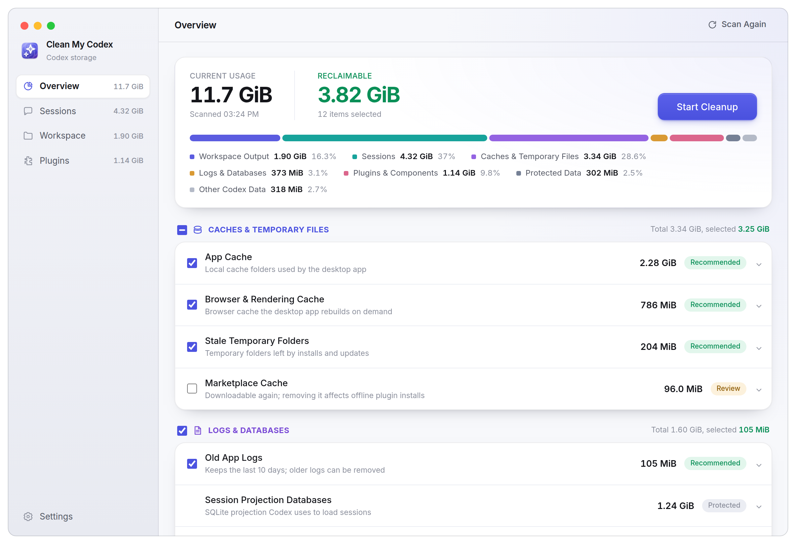

<div align="center">


**Find out what Codex has left on your disk.**

English · [简体中文](README_CN.md)

[](https://github.com/FinnaXxx/CleanMyCodex/releases)
[](https://github.com/FinnaXxx/CleanMyCodex/actions/workflows/ci.yml)


<picture>
  <source media="(prefers-color-scheme: dark)" srcset="docs/images/overview-en-dark.png">
  <source media="(prefers-color-scheme: light)" srcset="docs/images/overview-en-light.png">
  
</picture>

</div>

## Before you start

> [!IMPORTANT]
> **This is a testing-stage release — back up first.** Cleanup deletes permanently,
> and correct behaviour cannot be guaranteed for every Codex version on every machine.
> Take a backup before your first cleanup.

Pull requests are welcome.

## What it does

Codex accumulates: a rollout file for every conversation you have ever had, plugin versions it never got around to deleting, staging folders abandoned by an interrupted update, and whatever your sessions wrote to disk. Clean My Codex measures all of it in one pass, shows where the space actually went.

- **One scan, four areas.** The Codex data directory, sessions, plugins and workspace output, each with its own page and its own rules.
- **Honest numbers.** A SQLite database contributes what it really occupies; its reusable free pages are never presented as space you can reclaim.
- **Conservative by default.** Nothing is recommended without positive evidence that it is disposable, so a scan that recommends nothing is a normal result rather than a failure. Everything that is only counted is labelled that way in the interface.
- **Whole conversations.** A session that spans several rollout segments and several layers of subagents is one row in the list and one deletion, with every derived database and every desktop-side copy cleaned up alongside it.
- **Scheduled cleanup.** Runs on an interval over stale temporary folders, confirmed old plugin versions and aged-out conversations only. It skips pinned conversations, unfinished goals and queued work, and never touches caches, configuration or workspace output.

### What it will not delete

Configuration and credentials — `config.toml`, `auth.json`, the age-encrypted secret store under `secrets/`, the MCP OAuth fallback `.credentials.json` and `.env` — along with all six of Codex's runtime SQLite databases and the crash-recovery copies it keeps in `db-backups/`, the managed proxy CA in `proxy/`, the Windows sandbox identity files, the data plugins persist under `plugins/data`, the plugin version Codex is currently using and its runtimes, the Chromium profile data your desktop sign-in lives in, the desktop application's own logs, and every cache — both Codex's own operational metadata cache and the desktop application's runtime caches. Workspace output is additionally out of scope for scheduled runs. All of it is counted so the totals add up, and shown as protected.

## Install

Download the latest `.dmg` from [Releases](https://github.com/FinnaXxx/CleanMyCodex/releases). Builds are published for Apple Silicon (`arm64`) and Intel (`x64`).

The bundle is ad-hoc signed but not notarized, so the first launch goes through **System Settings → Privacy & Security → Open Anyway**.

## How scanning works

Scanning is scheduled by the Electron main process, and the expensive traversal runs in a worker so the interface never blocks. The result comes back in four parts:

- **Codex data directory** — caches, logs and temporary files. A SQLite database only contributes its actual footprint; reusable free pages are never listed as cleanable.
- **Sessions** — rollouts are read as a stream rather than loaded whole, session information is collected, and generated assets are linked back to the conversation that produced them.
- **Plugins** — the directories on disk are combined with what `codex app-server` reports, separating the current version from older versions and uninstall leftovers.
- **Workspace output** — scanned only once you open that page. Each output is matched with the source session title recorded in SQLite, and flagged when git has uncommitted or unpushed work.

A scan result is only a read-only snapshot. When cleanup runs, the main process rebuilds its task list from that snapshot and re-validates every path; caches, configuration, credentials, the state database, the current plugins and workspace output never enter scheduled cleanup.

### Where the data comes from

Every path under `~/.codex` below is checked against the [Codex sources](https://github.com/openai/codex), which is the harness the desktop application is built on, rather than inferred from one machine's directory listing. The desktop's own storage is not open source — the Application Support tree, the Chromium profile, `~/.codex/sqlite` and `.codex-global-state.json` are read from observed data instead, and are treated more cautiously for it: counted, never deleted as files.

Each source is scanned as what it actually is:

- **`codex app-server`** — `plugin/list` confirms which plugins and versions are installed. On versions that support `thread/delete`, Codex deletes the conversation itself; on versions that do not, the app falls back to targeted local cleanup.
- **Rollout JSONL** — `~/.codex/sessions` and `~/.codex/archived_sessions` are scanned as a stream. They are the durable record of session events, and the source Codex itself builds its session-history projection from.
- **`state_*.sqlite`** — read-only for titles, working directories, archive state and subagent parent/child links. A title prefers the concise `name` Codex generates, falling back to `title` and then `preview`, both of which usually hold the whole first user message. Parent/child links come from `thread_spawn_edges`. Rows are removed only when a session is deleted, and only those of that session and all of its descendants.
- **`session_index.jsonl`** — a supplementary index behind generated titles and the desktop session list. Deleting a session removes the index lines for exactly the same set of threads.
- **`thread_history_*.sqlite`** — the session-history projection Codex derives from the rollouts. The scanner counts it as a session projection database; deleting a session clears the matching rows directly instead of waiting for Codex to rebuild them.
- **`~/.codex/sqlite/*.db`** — the ChatGPT/Codex desktop's own storage. `local_thread_catalog` is the conversation list in the left sidebar, and the same directory holds session summaries and history snapshots. Rows are deleted by thread ID when a session is deleted; the files themselves never are.
- **`.codex-global-state.json`** — the desktop's persisted state, keyed by thread ID:pins, project membership, queued tasks. Only the keys and list items of deleted sessions are removed; `electron-persisted-atom-state` (drafts, panel layout and other interface state) is left alone as a whole.
- **`generated_images/<thread-id>`** — standalone image directories produced by a conversation.
- **`visualizations/YYYY/MM/DD/<thread-id>`** — the rich visual results Codex generates, such as JPG/PNG comparisons or HTML visualization previews. The date levels are walked recursively and attributed to the conversation they belong to.
- **`visualization-viewers/<thread-id>`** — the rendered viewers Codex materializes from those fragments, which its own code calls the viewer caches. Keyed by thread, so they are counted with their conversation and removed with it rather than outliving it.
- **`~/.codex/cache`** — the remote plugin catalog (`remote_plugin_catalog`), the Apps server and tool definitions (`codex_apps_server_info`, `codex_apps_tools`), the connector directory (`codex_app_directory`) and the terminal pet packs (`tui-pets`). Every one of them is rebuildable, but a future release may put live state beside them, so the whole directory is counted as protected data with no way to delete it.
- **`~/Library/Logs/com.openai.codex/YYYY/MM/DD`** — the desktop application's own logs, one file per session per process. The application rotates them itself, keeping only the last few days, so they are counted towards the totals and never offered: cleaning them would reclaim only what is about to be reclaimed anyway, and would take the recent sessions its own diagnostics read with it. Deletion is refused for the whole log tree.
- **`~/Library/Caches/Codex`, `~/Library/Caches/com.openai.codex`** — the desktop application's runtime caches. The container and every leaf directory inside it are counted as protected data, with no way to delete them.
- **The Chromium profile data your desktop sign-in lives in** — `Cookies`, `Network/`, `Local Storage`, `Session Storage`, `IndexedDB`, `Service Worker`, `Preferences`, `Web Data`, `Local State`, `Partitions/`, `codex-browser-app/` and the like. The root, `Default/` and the desktop's own partition layout are all locked: counted, never cleaned. Deletion is refused for the whole Application Support tree and for the platform cache containers.
- **`~/.codex/sqlite`, `.codex-global-state.json` and its `.bak`** — the desktop's own session database and persisted state. Rows and keys go only when a session is deleted; the files themselves are locked.
- **User-authored and live-state paths** — `rules`, `skills`, `hooks` and `hooks.json`, `memories`, `agents`, `themes`, `avatars`, `prompts`, `shell_snapshots`, `attachments`, `session_index.jsonl`, `installation_id`, `managed_config.toml`, `environments.toml`, the app-server daemon and control sockets, the Wasm TTS components and the goals/queue/memories/logs databases — counted towards usage, but kept locked.
- **`~/.codex/.tmp`** — despite the name, live state: the curated plugin checkout, the installed marketplaces, the bundled `openai-bundled` source and Codex's rollout locks all live here. Only the temporary-directory prefixes Codex creates itself are eligible, namely the `plugins-clone-*` checkouts and the `plugins-backup-*` directories that Codex's own startup sweep leaves behind because it only removes the clones. Any other unknown `.tmp` subdirectory is never inferred to be disposable just because it has sat there a long time.
- **`~/.codex/tmp/arg0`** — a different directory from `.tmp`, holding one locked directory per running Codex process for the `apply_patch` and sandbox helper shims. Codex deletes every unlocked sibling on launch, so the ones still there were abandoned by its own definition, and removing them costs the next launch a symlink rebuild.
- **The staging parents** — `.tmp/marketplaces/.staging`, `plugins/.remote-plugin-install-staging` and `plugins/.marketplace-plugin-source-staging`. Codex renames a finished tree out of each of these and drops the rest, so every surviving child belongs to a process that died mid-install.

**Recommended** on the overview holds two kinds of thing, and only these two, because they are the only ones backed by evidence beyond "it looks like a cache": install and update staging leftovers, which have to be more than 24 hours untouched, sit in a directory Codex itself treats as scratch, and not belong to the current source; and old plugin directories, where `plugin/list` has authoritatively confirmed a current version exists. A plugin directory named `local` is never one of them, whatever the catalog reports, because Codex resolves the active version from the directory listing alone and `local` outranks every numbered sibling. When neither kind is present, nothing is recommended, and that is the correct answer rather than a failed scan.

### Sessions, segments and subagents

One conversation can be spread across several rollout files, and can recursively spawn several layers of subagents. The interface shows a single top-level conversation, but every total and every action uses the full closure: all continuation segments of the main conversation, the segments of subagents at every level, and the generated images and Visualization directories belonging to each of them.

The first version does not scan, count, deduplicate or rewrite images embedded in a conversation, and offers no separate way to delete generated images. Session data can only be deleted whole, which keeps the rollouts, the derived SQLite databases and the interface caches from drifting out of step.

### What deleting a session actually does

Deleting a session requires ChatGPT/Codex to have quit. It then runs, in order:

1. Resolve every thread ID involved in this deletion: the IDs in the rollout file names, the subagents in `thread_spawn_edges`, and the records in `state_*.sqlite` whose rollout path points at those files. A desktop conversation has its own thread ID and does not appear in a file name, so it can only be found by looking up the rollout path.
2. Call the app-server's `thread/delete` for the main conversation, the desktop conversation record and each level of subagent, in preference to anything local. Each request permanently deletes that thread's continuation rollouts, database records and `session_index.jsonl` lines.
3. Where the version does not support the protocol, or any request fails, fall back to local compatible cleanup and permanently delete the rollouts the protocol did not handle.
4. Permanently delete the `generated_images` and Visualization directories, which the protocol does not manage.
5. Whether the protocol or the fallback ran, re-check `thread_history_*.sqlite`, `state_*.sqlite` and `session_index.jsonl` against the same set of thread IDs, and remove records still pointing at deleted rollouts.
6. Clean the desktop's own copy last: rows are deleted by thread ID from `~/.codex/sqlite/*.db` (`local_thread_catalog` is the sidebar conversation list, and the summary and history-snapshot databases sit beside it), and the matching mapping keys, list items and `…threadId` fields are stripped from `~/.codex/.codex-global-state.json` and its `.bak`. `thread/delete` does not cover these two — when the protocol reports success and the core data really is gone, but the conversation is still in the sidebar and opening it reports `no rollout found for thread id`, this is the step that was missing.

Every step records how many rows it removed in the cleanup log.

Configuration, credentials, the current plugins and workspace output are not removed along with a session; the `session_index.jsonl` lines tied directly to the target session are.

Automatic session cleanup skips pinned conversations, conversations with an unfinished goal, and conversations that still have a queued item; if any subagent meets one of those conditions, the whole top-level conversation is skipped. Pinning is read both from the `is_pinned` column in `state_*.sqlite` and from `pinned-thread-ids` in `.codex-global-state.json` — the desktop records pins in the latter, so reading only the column misses them. Manual deletion is not bound by those conditions: a conversation you selected and confirmed is deleted as you asked. The list marks pinned conversations, and the confirmation dialog says how many of the selected conversations are pinned. Before a manual deletion, SQLite integrity, the supported core tables and the write lock are checked first, so a database that cannot be modified is not discovered after the session files are already gone. Plugin deletion re-asks `codex app-server` for the current version immediately before it runs, so an upgrade between scan and cleanup cannot cause the wrong version to be removed.

### Logs

Cleanup is written to a log — cache and leftover removals record the path and byte count of each deletion, including the ones that failed or were skipped: macOS `~/Library/Logs/CleanMyCodex/cleanup.log`, Windows `%APPDATA%\CleanMyCodex\logs\cleanup.log`, Linux `~/.config/CleanMyCodex/logs/cleanup.log`. Each deletion records the thread IDs that were resolved, whether `thread/delete` was available, how many rows the local re-check removed, and which desktop table and state file were cleaned of how many entries. Past 1 MB, one generation of history is kept. Scheduled cleanup writes its own `autoclean.log`. Settings → Diagnostics → Logs opens that folder.

## Development

Requires Node.js 22 and pnpm 11.19.

```bash
pnpm install
pnpm dev
```

Full check:

```bash
pnpm check
```

Packaging:

```bash
pnpm build:mac
pnpm build:win
pnpm build:linux
```

## License

MIT
