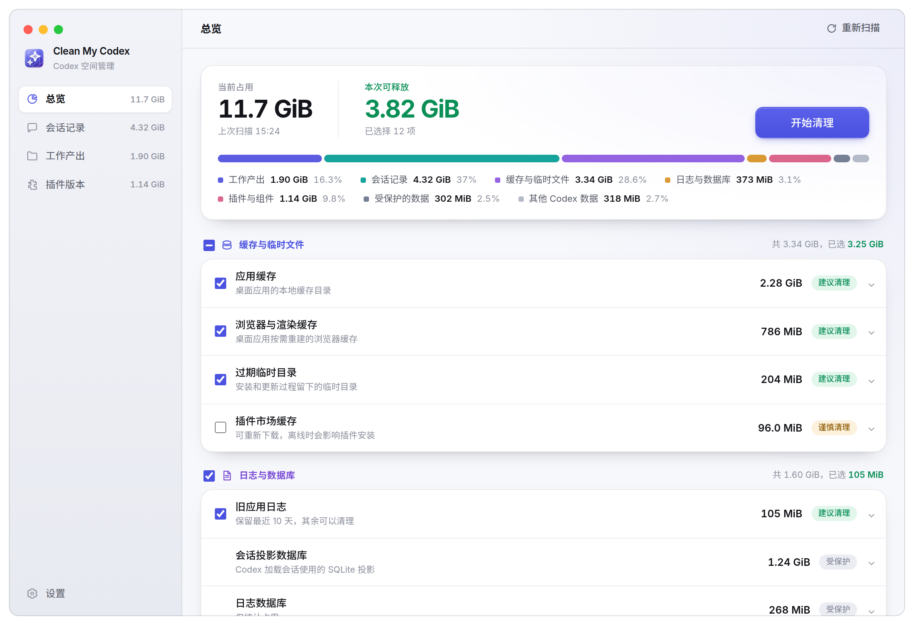

<div align="center">


**看看你的 Codex 占用了多少空间**

[English](README.md) · 简体中文

[](https://github.com/FinnaXxx/CleanMyCodex/releases)
[](https://github.com/FinnaXxx/CleanMyCodex/actions/workflows/ci.yml)


<picture>
  <source media="(prefers-color-scheme: dark)" srcset="docs/images/overview-zh-dark.png">
  <source media="(prefers-color-scheme: light)" srcset="docs/images/overview-zh-light.png">
  
</picture>

</div>

## 注意事项

> [!IMPORTANT]
> **当前是测试阶段，请提前备份。** 清理是永久删除，且不能保证在所有 Codex 版本、所有电脑上都能
> 正常工作。第一次清理前请先备份。

欢迎提 PR 共建。

## 这是什么

Codex 会不断堆积：每一次会话留下的 rollout 文件、一直没被删掉的插件旧版本、更新中断留下的 staging 目录，以及会话写到磁盘上的各种产出。Clean My Codex 一次扫清全部，告诉你空间到底去了哪里。

- **一次扫描，四个方向。** Codex 数据目录、会话、插件和工作产出，各有各的页面和各自的规则。
- **数字如实。** SQLite 数据库只统计实际占用，可复用的空闲页不会被算成可释放空间。
- **默认保守。** 没有正面证据表明可以删的东西一律不推荐，所以扫描结果里推荐项为 0 是正常结果，不是扫描失败。只统计、不删除的内容在界面上都会标出来。
- **会话按整体处理。** 跨多个 rollout 分段、带多层子代理的会话在列表里是一行，删除也是一次，连带派生数据库和桌面端自己的那份副本一起清理。
- **定时清理。** 按周期运行，范围只有过期临时目录、已确认的插件旧版本和超过保留期的会话；跳过置顶会话、未完成的 goal 和排队中的任务，不碰缓存、配置和工作产出。

### 不会被删除的东西

配置与凭据（`config.toml`、`auth.json`）、状态数据库与会话投影数据库、Codex 当前正在使用的插件版本及其运行组件、承载桌面端登录的 Chromium 用户资料数据，以及全部缓存 —— 既包括 Codex 自己的运行元数据缓存，也包括桌面应用的运行缓存。工作产出另外不进入定时清理。这些都会被统计以保证总量对得上，并在界面上标记为受保护。

## 安装

从 [Releases](https://github.com/FinnaXxx/CleanMyCodex/releases) 下载最新的 `.dmg`，提供 Apple Silicon（`arm64`）和 Intel（`x64`）两个安装包。

安装包做了 ad-hoc 签名但未做公证，首次打开需要在 **系统设置 → 隐私与安全性 → 仍要打开** 里放行一次。

## 扫描设计

扫描由 Electron 主进程统一调度，耗时的文件遍历放在 worker 中执行，避免阻塞界面。扫描结果分为四部分：

- **Codex 数据目录**：识别缓存、日志和临时文件；SQLite 数据库仅统计实际占用，不把可复用空闲页列为清理项。
- **会话**：流式读取 rollout，统计会话信息并关联生成资产，避免一次加载大文件。
- **插件**：结合磁盘目录和 `codex app-server` 返回的信息，区分当前版本、旧版本和卸载残留。
- **工作产出**：仅在用户打开对应页面后扫描，优先关联 SQLite 中的来源会话标题，并标记 git 未提交或未推送状态。

扫描结果只是只读快照。执行清理时，主进程会根据快照重新生成任务并校验路径；缓存、配置、凭据、状态库、当前插件和工作产出不会进入定时清理范围。

### 数据来源

按数据的实际来源扫描：

- **`codex app-server`**：调用 `plugin/list` 确认已安装的插件及版本；支持 `thread/delete` 的版本会优先由 Codex 自己删除会话，不支持时回退到本地定向清理。
- **rollout JSONL**：直接流式扫描 `~/.codex/sessions` 和 `~/.codex/archived_sessions`。它们是会话事件的持久记录；Codex 也以 rollout 为来源构建会话历史投影。
- **`state_*.sqlite`**：只读获取标题、工作目录、归档状态及子代理父子关系；删除会话时才定向删除该会话及所有后代的状态行。
- **`session_index.jsonl`**：作为生成标题和桌面会话列表的补充索引；删除会话时会定向移除相同会话集合的索引行。
- **`thread_history_*.sqlite`**：Codex 从 rollout 派生出的会话历史投影。扫描器把它作为“会话投影数据库”统计；删除会话时会直接清理相应行，不等待 Codex 重建。
- **`~/.codex/sqlite/*.db`**：ChatGPT/Codex 桌面端自己的存储，`local_thread_catalog` 是左侧边栏的会话列表，同目录还有会话摘要和历史快照。只在删除会话时按 thread ID 定向删行，从不删文件。
- **`.codex-global-state.json`**：桌面端的持久化状态，按 thread ID 存置顶、项目归属、排队任务等。只剔除被删会话的键和列表项；`electron-persisted-atom-state`（草稿、面板布局等界面状态）整块保持不动。
- **`generated_images/<thread-id>`**：会话生成的独立图片目录。
- **`visualizations/YYYY/MM/DD/<thread-id>`**：Codex 生成的富视觉结果，例如 JPG/PNG 对比图或 HTML可视化预览。扫描时会递归识别日期层级并归到对应会话。
- **`~/.codex/cache`**：Codex 使用的远程插件目录、工具定义、connector runtime 和 Apps server 信息，作为受保护数据统计，不提供删除。
- **`~/Library/Caches/Codex`、`~/Library/Caches/com.openai.codex`**：桌面应用运行缓存，容器及其所有叶子目录都作为受保护数据统计，不提供删除。
- **承载桌面端登录的 Chromium 用户资料数据**：`Cookies`、`Network/`、`Local Storage`、`Session Storage`、`IndexedDB`、`Service Worker`、`Preferences`、`Web Data`、`Local State`、`Partitions/`、`codex-browser-app/` 等。根目录、`Default/` 和桌面端专用分区布局都锁定，只统计不清理；整个 App Support 和平台应用缓存容器都禁止删除。
- **`~/.codex/sqlite`、`.codex-global-state.json` 及其 `.bak`**：桌面端自己的会话库和持久状态，只在删除会话时按 thread ID 删行或删键，文件本身锁定。
- **`vendor_imports`、`shell_snapshots`、`attachments`、`ambient-suggestions`、`browser`、Wasm TTS 组件及 goals/queue/memories 数据库**：纳入占用统计但保持锁定。
- **`.tmp/bundled-marketplaces`**：只保护当前 `openai-bundled` 源；超过 24 小时未更新的同级 `.staging-*` 目录作为更新残留列出。其他未知 `.tmp` 子目录不会因为存放时间长就自动推断为可删。

首页「建议清理」只包含两类有额外证据的内容：超过 24 小时未写入、路径模式明确且不属于当前源的安装／更新 staging 残留；以及 `plugin/list` 权威确认已有当前版本的旧插件目录。没有这两类内容时，推荐项为 0 是正常结果。

### 会话、分段与子代理

同一个会话可能分散在多个 rollout 文件中，也可能递归生成多层子代理。界面只显示一个顶层会话，但统计与操作使用完整会话闭包：主会话的所有续写分段、所有层级子代理的分段，以及各自关联的生成图片和 Visualization 目录。

第一版不扫描、统计、去重或改写会话内嵌图片，也不提供单独删除生成图片的入口。会话数据只支持整段删除，避免出现 rollout、派生 SQLite 和界面缓存之间状态不一致。

### 删除会话实际执行的操作

删除一个会话需要 ChatGPT/Codex 已退出，随后依次执行：

1. 先解析这次删除涉及的全部 thread ID：rollout 文件名里的 ID、`thread_spawn_edges` 里的子代理，以及 `state_*.sqlite` 中 rollout 路径指向这些文件的记录。桌面会话有自己的 thread ID，且不出现在文件名里，只能靠 rollout 路径反查。
2. 优先对主会话、桌面会话记录及每个层级子代理分别调用 Codex app-server 的 `thread/delete`；每个请求会永久删除该 thread 的全部续写 rollout、数据库记录和 `session_index.jsonl` 行。
3. 旧版本不支持协议或任一请求失败时，回退到本地兼容清理，并永久删除协议未处理的 rollout。
4. 永久删除协议不管理的 `generated_images`、Visualization 目录。
5. 无论走协议还是回退，最后都用同一组 thread ID 复查一次 `thread_history_*.sqlite`、`state_*.sqlite` 和 `session_index.jsonl`，删除仍指向已删除 rollout 的记录。
6. 最后清理桌面端自己的那份副本：`~/.codex/sqlite/*.db`（`local_thread_catalog` 就是左侧边栏的会话列表，同目录还有摘要库和历史快照库）按 thread ID 删行；`~/.codex/.codex-global-state.json` 及其`.bak` 剔除对应的映射键、列表项和 `…threadId` 字段。`thread/delete` 不管这两处 —— 协议报成功、内核数据也确实清干净了，会话照样留在侧边栏，点开报 `no rollout found for thread id`，就是这里没删。

每一步删掉多少行都会记进清理日志。

配置、凭据、当前插件和工作产出不会随会话删除；与目标会话直接关联的 `session_index.jsonl` 行会一并删除。

自动会话清理会跳过置顶会话、存在未完成 goal 的会话和仍有 queued item 的会话；任一子代理满足这些条件时，整个顶层会话都会跳过。置顶同时取自 `state_*.sqlite` 的 `is_pinned` 列和 `.codex-global-state.json` 的 `pinned-thread-ids` —— 桌面端把置顶记在后者，只看列会漏。手动删除不受这些条件限制：明确选中并确过的会话就按用户的意思删，会话列表会给置顶会话标出「置顶」，确认弹窗也会说明所选会话里有几个是置顶的手动删除前会先检查 SQLite 完整性、受支持的核心表和写锁，避免会话文件已经删除后才发现数据库无法修改插件删除则会在真正执行前重新向 `codex app-server` 查询当前版本，防止扫描后升级造成误删。

### 日志

清理会写入清理日志（缓存和残留清理逐条记录删掉的路径与字节数，删除失败或跳过的也记）：macOS `~/Library/Logs/CleanMyCodex/cleanup.log`，Windows `%APPDATA%\CleanMyCodex\logs\cleanup.log`，Linux `~/.config/CleanMyCodex/logs/cleanup.log`。每次删除记录解析出的 thread ID、`thread/delete` 是否可用、本地复查删掉了多少行，以及桌面端的哪张表、哪个状态文件被清理了多少条，超过 1 MB 保留一代历史。定时清理另有 `autoclean.log`。

## 开发

需要 Node.js 22 和 pnpm 11.19。

```bash
pnpm install
pnpm dev
```

完整检查：

```bash
pnpm check
```

打包：

```bash
pnpm build:mac
pnpm build:win
pnpm build:linux
```

## 许可

MIT
