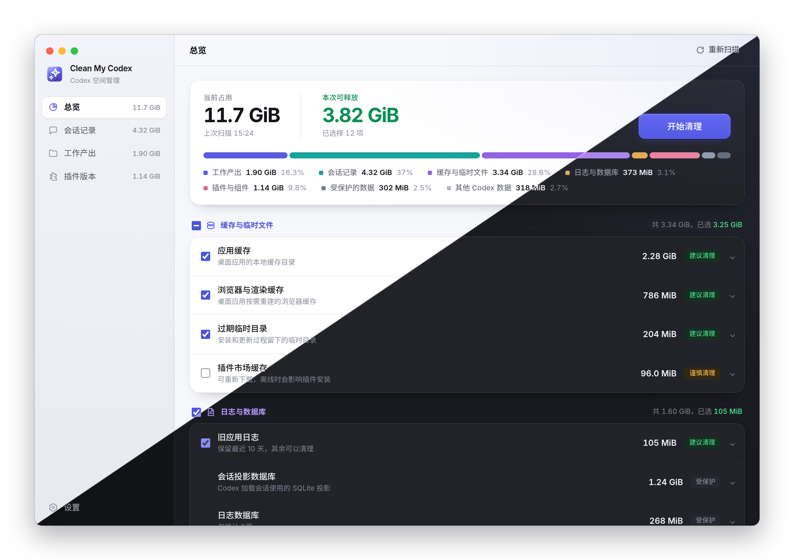

<div align="center">


# Clean My Codex

**看清 Codex 在磁盘上留下了什么，只删掉确实可以删的那部分。**

[English](README.md) · 简体中文

[](https://github.com/FinnaXxx/CleanMyCodex/releases)
[](https://github.com/FinnaXxx/CleanMyCodex/actions/workflows/ci.yml)




</div>

## 这是什么

Codex 会不断堆积：几秒就能重建的缓存、每一次会话留下的 rollout 文件、一直没被删掉的插件旧版本，
以及会话写到磁盘上的各种产出。Clean My Codex 一次扫清全部，告诉你空间到底去了哪里，然后只删掉你
勾选的部分。

- **一次扫描，四个方向。** Codex 数据目录、会话、插件和工作产出，各有各的页面和各自的规则。
- **数字如实。** SQLite 数据库只统计实际占用，可复用的空闲页不会被算成可释放空间。
- **默认保守。** 只统计、不删除的内容在界面上都会标出来，默认勾选范围始终落在确实安全的部分。
- **会话按整体处理。** 跨多个 rollout 分段、带多层子代理的会话在列表里是一行，删除也是一次，
  连带派生数据库和桌面端自己的那份副本一起清理。
- **定时清理。** 按周期运行，跳过置顶会话、未完成的 goal 和排队中的任务，不碰配置和工作产出。
- **双语，明暗两套。** 简体中文与英文，跟随系统外观或固定选择。

### 不会被删除的东西

配置与凭据（`config.toml`、`auth.json`）、状态数据库、会话投影数据库、Codex 当前正在使用的插件版本
及其运行组件，以及定时清理时的工作产出。这些会被统计以保证总量对得上，并在界面上标记为受保护。

## 安装

从 [Releases](https://github.com/FinnaXxx/CleanMyCodex/releases) 下载最新的 `.dmg`，
提供 Apple Silicon（`arm64`）和 Intel（`x64`）两个安装包。

安装包做了 ad-hoc 签名但未做公证，首次打开需要在
**系统设置 → 隐私与安全性 → 仍要打开** 里放行一次。

构建配置里同时保留了 Windows（NSIS）和 Linux（AppImage）目标，可以自行从源码打包，但暂未发布安装包。

## 扫描设计

扫描由 Electron 主进程统一调度，耗时的文件遍历放在 worker 中执行，避免阻塞界面。扫描结果分为四部分：

- **Codex 数据目录**：识别缓存、日志和临时文件；SQLite 数据库仅统计实际占用，不把可复用空闲页
  列为清理项。
- **会话**：流式读取 rollout，统计会话信息并关联生成资产，避免一次加载大文件。
- **插件**：结合磁盘目录和 `codex app-server` 返回的信息，区分当前版本、旧版本和卸载残留。
- **工作产出**：仅在用户打开对应页面后扫描，优先关联 SQLite 中的来源会话标题，并标记 git 未提交
  或未推送状态。

扫描结果只是只读快照。执行清理时，主进程会根据快照重新生成任务并校验路径；配置、凭据、状态库、
当前插件和工作产出不会进入定时清理范围。

### 数据来源

按数据的实际来源扫描：

- **`codex app-server`**：调用 `plugin/list` 确认已安装的插件及版本；支持 `thread/delete` 的版本
  会优先由 Codex 自己删除会话，不支持时回退到本地定向清理。
- **rollout JSONL**：直接流式扫描 `~/.codex/sessions` 和 `~/.codex/archived_sessions`。它们是会话
  事件的持久记录；Codex 也以 rollout 为来源构建会话历史投影。
- **`state_*.sqlite`**：只读获取标题、工作目录、归档状态及子代理父子关系；删除会话时才定向删除该
  会话及所有后代的状态行。
- **`session_index.jsonl`**：作为生成标题和桌面会话列表的补充索引；删除会话时会定向移除相同会话
  集合的索引行。
- **`thread_history_*.sqlite`**：Codex 从 rollout 派生出的会话历史投影。扫描器把它作为“会话投影
  数据库”统计；删除会话时会直接清理相应行，不等待 Codex 重建。
- **`~/.codex/sqlite/*.db`**：ChatGPT/Codex 桌面端自己的存储，`local_thread_catalog` 是左侧边栏的
  会话列表，同目录还有会话摘要和历史快照。只在删除会话时按 thread ID 定向删行，从不删文件。
- **`.codex-global-state.json`**：桌面端的持久化状态，按 thread ID 存置顶、项目归属、排队任务等。
  只剔除被删会话的键和列表项；`electron-persisted-atom-state`（草稿、面板布局等界面状态）整块
  保持不动。
- **`generated_images/<thread-id>`**：会话生成的独立图片目录。
- **`visualizations/YYYY/MM/DD/<thread-id>`**：Codex 生成的富视觉结果，例如 JPG/PNG 对比图或 HTML
  可视化预览。扫描时会递归识别日期层级并归到对应会话。
- **`~/.codex/cache`、App Support 顶层 `Cache`/`GraphiteDawnCache`**：作为可重建缓存统计，要求
  ChatGPT/Codex 退出后才能清理。
- **`vendor_imports`、`shell_snapshots`、`attachments`、`ambient-suggestions`、`browser`、Wasm TTS
  组件及 goals/queue/memories 数据库**：纳入占用统计但保持锁定。
- **`.tmp/bundled-marketplaces`**：只保护当前 `openai-bundled` 源；超过一小时未更新的同级
  `.staging-*` 目录作为更新残留列出。

### 会话、分段与子代理

同一个会话可能分散在多个 rollout 文件中，也可能递归生成多层子代理。界面只显示一个顶层会话，但统计
与操作使用完整会话闭包：主会话的所有续写分段、所有层级子代理的分段，以及各自关联的生成图片和
Visualization 目录。

第一版不扫描、统计、去重或改写会话内嵌图片，也不提供单独删除生成图片的入口。会话数据只支持整段删除，
避免出现 rollout、派生 SQLite 和界面缓存之间状态不一致。

### 删除会话实际执行的操作

删除一个会话需要 ChatGPT/Codex 已退出，随后依次执行：

1. 先解析这次删除涉及的全部 thread ID：rollout 文件名里的 ID、`thread_spawn_edges` 里的子代理，
   以及 `state_*.sqlite` 中 rollout 路径指向这些文件的记录。桌面会话有自己的 thread ID，且不出现在
   文件名里，只能靠 rollout 路径反查。
2. 优先对主会话、桌面会话记录及每个层级子代理分别调用 Codex app-server 的 `thread/delete`；每个请求
   会永久删除该 thread 的全部续写 rollout、数据库记录和 `session_index.jsonl` 行。
3. 旧版本不支持协议或任一请求失败时，回退到本地兼容清理，并永久删除协议未处理的 rollout。
4. 永久删除协议不管理的 `generated_images`、Visualization 目录。
5. 无论走协议还是回退，最后都用同一组 thread ID 复查一次 `thread_history_*.sqlite`、
   `state_*.sqlite` 和 `session_index.jsonl`，删除仍指向已删除 rollout 的记录。
6. 最后清理桌面端自己的那份副本：`~/.codex/sqlite/*.db`（`local_thread_catalog` 就是左侧边栏的会话
   列表，同目录还有摘要库和历史快照库）按 thread ID 删行；`~/.codex/.codex-global-state.json` 及其
   `.bak` 剔除对应的映射键、列表项和 `…threadId` 字段。`thread/delete` 不管这两处 —— 协议报成功、
   内核数据也确实清干净了，会话照样留在侧边栏，点开报 `no rollout found for thread id`，就是这里
   没删。

每一步删掉多少行都会记进清理日志。

配置、凭据、当前插件和工作产出不会随会话删除；与目标会话直接关联的 `session_index.jsonl` 行会一并删除。

自动会话清理会跳过置顶会话、存在未完成 goal 的会话和仍有 queued item 的会话；任一子代理满足这些条件
时，整个顶层会话都会跳过。置顶同时取自 `state_*.sqlite` 的 `is_pinned` 列和 `.codex-global-state.json`
的 `pinned-thread-ids` —— 桌面端把置顶记在后者，只看列会漏。手动删除不受这些条件限制：明确选中并确认
过的会话就按用户的意思删，会话列表会给置顶会话标出「置顶」，确认弹窗也会说明所选会话里有几个是置顶的。
手动删除前会先检查 SQLite 完整性、受支持的核心表和写锁，避免会话文件已经删除后才发现数据库无法修改。
插件删除则会在真正执行前重新向 `codex app-server` 查询当前版本，防止扫描后升级造成误删。

### 日志

会话删除会写入清理日志：macOS `~/Library/Logs/CleanMyCodex/cleanup.log`，
Windows `%APPDATA%\CleanMyCodex\logs\cleanup.log`，
Linux `~/.config/CleanMyCodex/logs/cleanup.log`。每次删除记录解析出的 thread ID、`thread/delete`
是否可用、本地复查删掉了多少行，以及桌面端的哪张表、哪个状态文件被清理了多少条，超过 1 MB 保留
一代历史。定时清理另有 `autoclean.log`。

## 开发

需要 Node.js 22 和 pnpm 11.19。

```bash
pnpm install
pnpm dev
```

完整检查：

```bash
pnpm check
```

打包：

```bash
pnpm build:mac
pnpm build:win
pnpm build:linux
```

README 里的截图由真实界面生成，见 [`scripts/screenshots`](scripts/screenshots/README.md)。

## 许可

MIT
